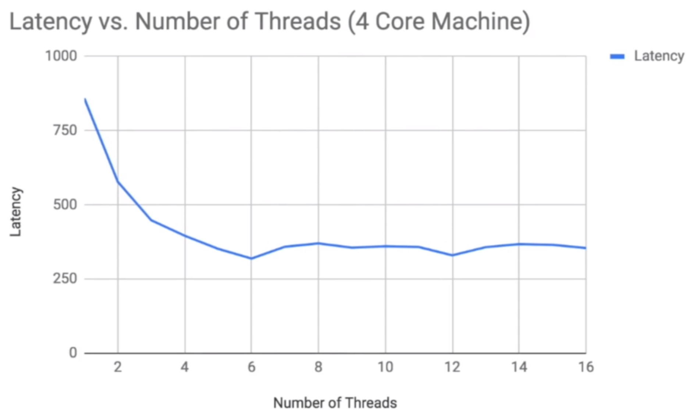

# Java-Multithread
Practice of Java Multi-thread 

In ImageProcessing.java, I use lambda function with threads to do image processing.

Since we want to know whether adding more threads in the image processing decreases the latency, I tested it several times and the 

relationship between number of threads and latency is in the following graph.

